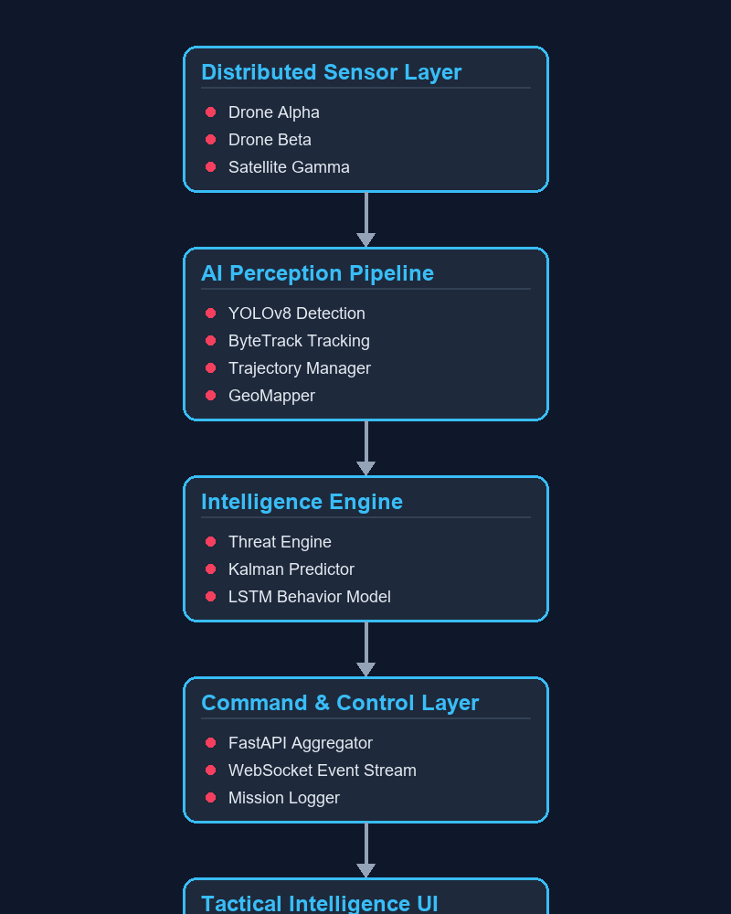

# Defense Vision Intelligence System (GEOINT)

An elite-grade Geospatial Intelligence (GEOINT) surveillance platform capable of detecting, tracking, geolocating, and predicting the movement of tactical assets across distributed sensor feeds.

## 🚀 System Capabilities

- **Detection**: Real-time object detection using YOLOv8 trained on multi-source datasets (VisDrone, DOTA, xView).
- **Tracking**: Robust ID persistence using ByteTrack across crowded aerial scenes.
- **Geospatial Intelligence**: Pixel-to-geographic coordinate conversion with CRS transformation (Rasterio/PyProj).
- **Predictive Analytics**: Dual-layer forecasting using Kalman Filters (short-term) and LSTM Deep Learning (long-term 30s+).
- **Behavioral AI**: Adaptive threat scoring based on target type, kinematics, and spatial proximity.
- **Distributed Sensors**: Simulated multi-node ingestion (Drones/Satellites) feeding a centralized command center.
- **Mission Center**: Real-time tactical dashboard with historical mission recording and 1:1 fidelity replay.

## 🧠 System Architecture



## 🛠️ Tech Stack

- **Computer Vision**: Ultralytics YOLOv8, ByteTrack
- **ML Frameworks**: PyTorch, Scikit-learn
- **Geospatial**: Rasterio, PyProj, GeoPandas, Folium
- **Backend / Real-time**: FastAPI, WebSockets, Uvicorn
- **Dashboard**: Vanilla JS, Leaflet.js, CSS Grid
- **Deployment**: Docker, Docker-Compose, ONNX/TensorRT Export

## 🏗️ Phased Development Journey

1.  **Phase 1-2**: Environment setup & Dataset Engineering (VisDrone, DOTA, xView).
2.  **Phase 3-4**: Training YOLOv8 & Multi-Object Tracking (ByteTrack).
3.  **Phase 5-6**: Geospatial Mapping & Real-time Interactive Dashboard.
4.  **Phase 7-8**: Predictive Intelligence (Kalman/LSTM) & Behavioral Threat Scoring.
5.  **Phase 9-10**: Distributed Multi-Node Ingestion & Mission Replay System.

## 🚦 How to Run

1.  **Start Central Server**:
    ```bash
    python api/app.py
    ```
2.  **Launch Sensor Simulation**:
    ```bash
    python tests/simulate_distributed.py
    ```
3.  **Access Dashboard**:
    Open `dashboard/index.html` in your browser.

## 📡 Example Intelligence Event

```json
{
  "node": "SAT_GAMMA",
  "target_id": 4,
  "class": "aircraft",
  "latitude": 36.1630,
  "longitude": -115.1387,
  "threat_score": 0.67,
  "prediction_30s": [36.1634, -115.1380]
}
```

---
*Industrial-Designed, Pre-Deployment Validated GEOINT Architecture.*
